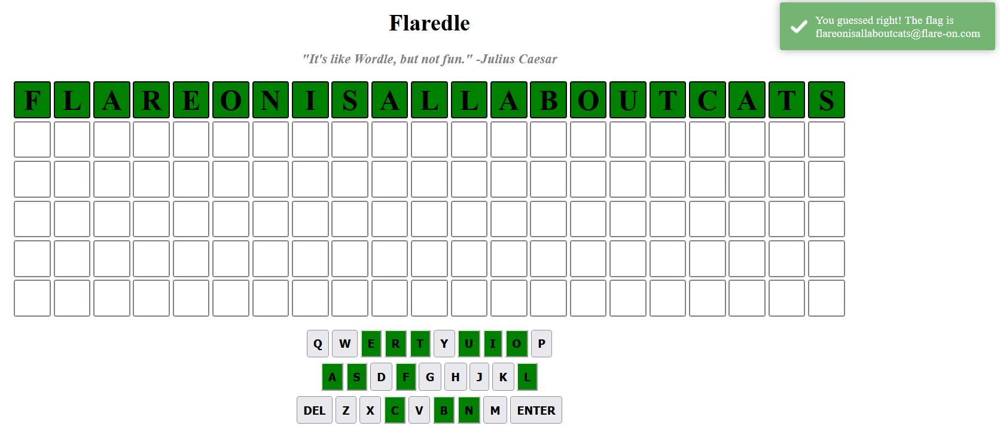

# Problem
> 
>
>    Welcome to Flare-On 9!
>
>    You probably won’t win. Maybe you’re like us and spent the year playing Wordle. We made our own version that is too hard to beat without cheating.
>
>    Play it live at: http://flare-on.com/flaredle/
>
>    7-zip password: flare

# Solve

看 `index.html` 會 load `script.js`
看 `script.js` 找吐 flag 的，會知道要是
```
const CORRECT_GUESS = 57;
let rightGuessString = WORDS[CORRECT_GUESS];
```
他會 load `words.js` ，所以看一下 `words.js` 只是一個 array

所以就找到 index 57 的值就是 flag

輸入網頁會顯示：
